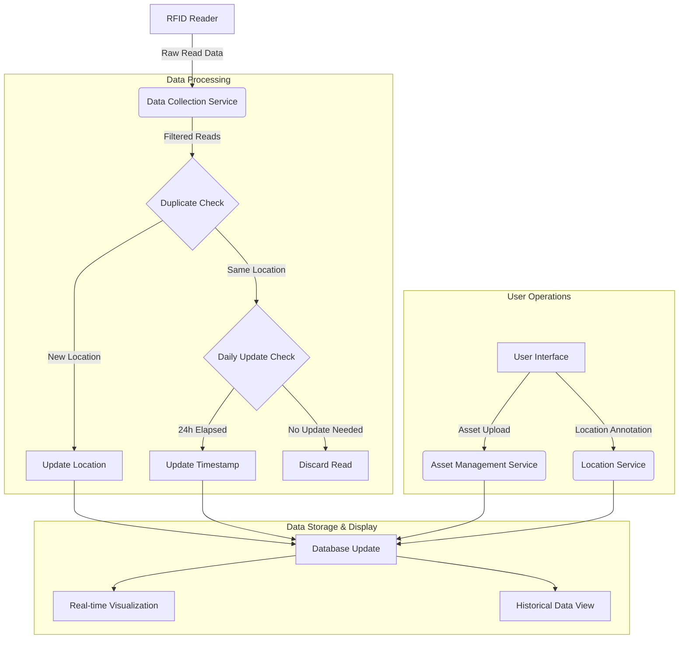
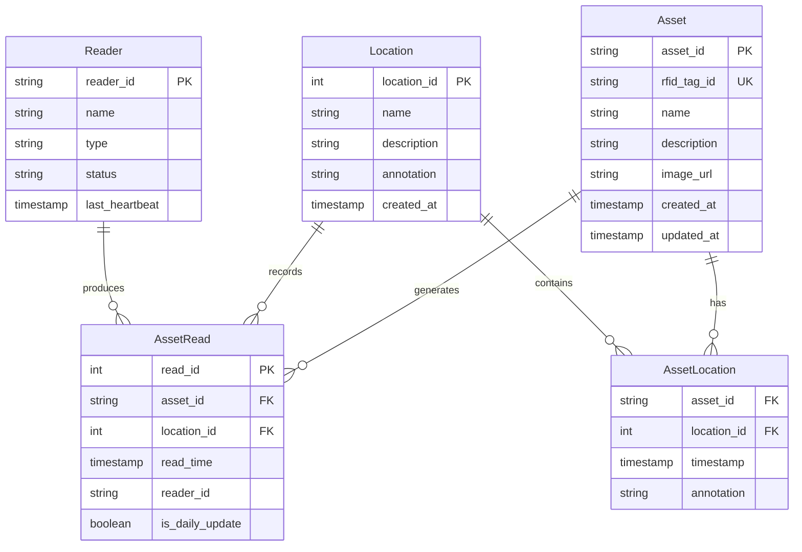
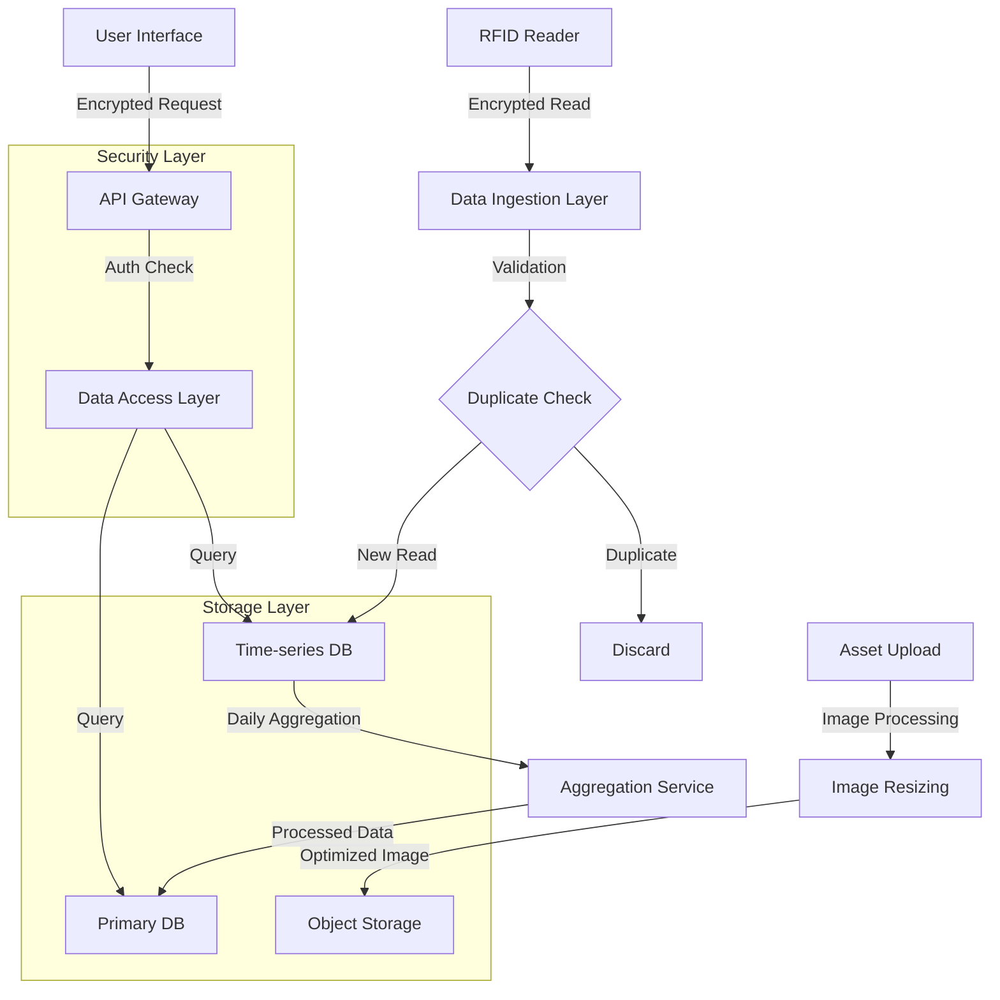
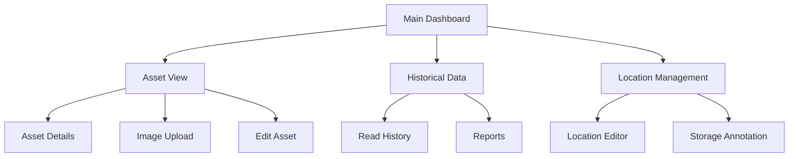
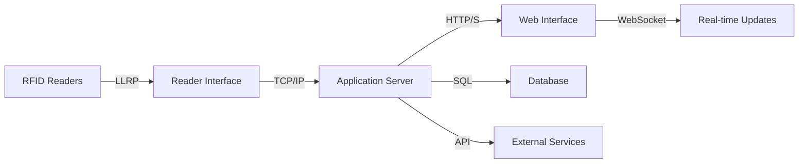

# Product Requirements Document (PRD)

# 1. INTRODUCTION

## 1.1 Purpose
This Product Requirements Document (PRD) specifies the requirements for an RFID Asset Tracking and Visualization System. The document serves as a comprehensive guide for developers, project managers, stakeholders, and quality assurance teams involved in the development and implementation of the system. It provides detailed functional and non-functional requirements, system constraints, and specifications necessary for successful project execution.

## 1.2 Scope
The RFID Asset Tracking and Visualization System is designed to capture, process, and visualize data from fixed RFID readers in real-time. The system encompasses:

- Real-time asset tracking using fixed RFID readers
- Asset information management including descriptions and images
- Location annotation and storage tracking
- Historical data visualization and reporting
- Intelligent read filtering and business logic implementation
- Multiple visualization interfaces for asset monitoring

Key benefits include:
- Improved asset visibility and tracking efficiency
- Reduced manual tracking effort
- Enhanced asset utilization through location awareness
- Streamlined inventory management
- Data-driven decision making through historical tracking
- Prevention of duplicate readings through intelligent filtering

The system will not include:
- RFID tag programming functionality
- Physical security management
- Asset maintenance scheduling
- Integration with procurement systems
- Financial asset valuation

# 2. PRODUCT DESCRIPTION

## 2.1 Product Perspective
The RFID Asset Tracking and Visualization System operates as a standalone application that interfaces with fixed RFID readers and maintains its own database of asset information. The system fits into the broader asset management ecosystem by:

- Integrating with existing fixed RFID reader infrastructure
- Operating independently of existing inventory management systems
- Providing a web-based interface accessible across the organization's network
- Storing asset data in a centralized database
- Supporting multiple concurrent users and visualization sessions

## 2.2 Product Functions
The system provides the following core functions:

- Real-time RFID data collection and processing
  - Continuous monitoring of fixed RFID readers
  - Intelligent filtering of duplicate reads
  - Location-based asset tracking
  
- Asset Information Management
  - Asset metadata storage and retrieval
  - Image upload and association with assets
  - Location annotation and storage tracking
  - Custom attribute management

- Data Visualization
  - Real-time asset location display
  - Historical tracking data views
  - Customizable dashboards
  - Asset movement reporting
  - Last seen location tracking

- Business Logic Implementation
  - Configurable read filtering rules
  - Location-based update triggers
  - Daily status recording
  - Duplicate read elimination

## 2.3 User Characteristics
Primary user types include:

1. Asset Managers
   - Advanced system knowledge
   - Responsible for overall asset tracking
   - Needs comprehensive system access
   - Configures business rules and filtering logic

2. Operations Staff
   - Basic to intermediate technical skills
   - Regular system users for daily tracking
   - Focuses on location updates and status checks
   - Requires simple, intuitive interface

3. Inventory Controllers
   - Intermediate technical knowledge
   - Performs regular audits and checks
   - Needs access to historical data
   - Updates asset information and annotations

## 2.4 Constraints
- Technical Constraints
  - Must support existing RFID reader protocols
  - Browser compatibility requirements
  - Network bandwidth limitations
  - Database performance requirements
  - Image storage capacity limits

- Operational Constraints
  - Real-time processing requirements
  - 24/7 system availability
  - Maximum allowable system response time
  - Concurrent user support limitations

- Security Constraints
  - User authentication requirements
  - Data encryption standards
  - Access control restrictions
  - Audit trail maintenance

## 2.5 Assumptions and Dependencies
Assumptions:
- Reliable network connectivity to RFID readers
- Sufficient server infrastructure
- Consistent RFID tag formatting
- User access to web browsers
- Adequate storage capacity for asset images

Dependencies:
- RFID reader firmware compatibility
- Network infrastructure reliability
- Database management system availability
- Web server functionality
- File storage system capacity
- Browser support for visualization components

# 3. PROCESS FLOWCHART

# 4. FUNCTIONAL REQUIREMENTS

## 4.1 RFID Data Collection and Processing

### ID: F-001
### Description
Real-time collection and processing of RFID tag reads from fixed readers
### Priority
High
### Requirements

| Requirement ID | Description | Priority |
|---------------|-------------|-----------|
| F-001.1 | System shall continuously monitor and collect data from fixed RFID readers | High |
| F-001.2 | System shall filter duplicate reads from the same location within 1-second intervals | High |
| F-001.3 | System shall update asset location only when position changes are detected | High |
| F-001.4 | System shall perform daily timestamp updates for static assets | Medium |
| F-001.5 | System shall support multiple simultaneous reader connections | High |

## 4.2 Asset Information Management

### ID: F-002
### Description
Management of asset metadata, images, and location information
### Priority
High
### Requirements

| Requirement ID | Description | Priority |
|---------------|-------------|-----------|
| F-002.1 | System shall maintain a database of asset information including descriptions and IDs | High |
| F-002.2 | System shall support image upload and association with specific assets | Medium |
| F-002.3 | System shall allow users to annotate asset storage locations | High |
| F-002.4 | System shall track last known location for each asset | High |
| F-002.5 | System shall support custom asset attributes | Low |

## 4.3 Visualization Interface

### ID: F-003
### Description
Multiple visualization options for asset tracking and monitoring
### Priority
High
### Requirements

| Requirement ID | Description | Priority |
|---------------|-------------|-----------|
| F-003.1 | System shall provide real-time visualization of asset locations | High |
| F-003.2 | System shall display historical read data in tabular format | High |
| F-003.3 | System shall support filtering and sorting of asset views | Medium |
| F-003.4 | System shall display asset images and descriptions on demand | Medium |
| F-003.5 | System shall provide customizable dashboard views | Low |

## 4.4 Business Logic Implementation

### ID: F-004
### Description
Configurable rules for data processing and updates
### Priority
High
### Requirements

| Requirement ID | Description | Priority |
|---------------|-------------|-----------|
| F-004.1 | System shall implement configurable duplicate read filtering | High |
| F-004.2 | System shall support location-based update triggers | High |
| F-004.3 | System shall maintain daily status records for static assets | Medium |
| F-004.4 | System shall support custom business rule creation | Low |
| F-004.5 | System shall provide audit logging of rule execution | Medium |

## 4.5 Data Export and Reporting

### ID: F-005
### Description
Export and reporting capabilities for asset tracking data
### Priority
Medium
### Requirements

| Requirement ID | Description | Priority |
|---------------|-------------|-----------|
| F-005.1 | System shall support export of historical read data | Medium |
| F-005.2 | System shall generate asset location reports | Medium |
| F-005.3 | System shall support custom report creation | Low |
| F-005.4 | System shall provide automated report scheduling | Low |
| F-005.5 | System shall support multiple export formats (CSV, PDF, Excel) | Medium |

# 5. NON-FUNCTIONAL REQUIREMENTS

## 5.1 Performance

| Requirement ID | Description | Target Metric |
|---------------|-------------|---------------|
| NF-001.1 | System response time for real-time visualization updates | < 2 seconds |
| NF-001.2 | RFID read processing latency | < 500ms |
| NF-001.3 | Maximum concurrent user support | 100 users |
| NF-001.4 | Database query response time | < 1 second |
| NF-001.5 | Image loading time | < 3 seconds |
| NF-001.6 | Historical data retrieval (1 month of data) | < 5 seconds |
| NF-001.7 | Maximum CPU utilization | < 75% |
| NF-001.8 | Maximum memory usage | < 8GB |

## 5.2 Safety

| Requirement ID | Description | Priority |
|---------------|-------------|-----------|
| NF-002.1 | Automated data backup every 24 hours | High |
| NF-002.2 | Failover system for reader connection loss | High |
| NF-002.3 | Data recovery point objective (RPO) | 1 hour |
| NF-002.4 | Data recovery time objective (RTO) | 4 hours |
| NF-002.5 | System state recovery after crash | High |

## 5.3 Security

| Requirement ID | Description | Priority |
|---------------|-------------|-----------|
| NF-003.1 | Role-based access control implementation | High |
| NF-003.2 | Data encryption at rest using AES-256 | High |
| NF-003.3 | SSL/TLS encryption for data in transit | High |
| NF-003.4 | Password complexity requirements | High |
| NF-003.5 | Session timeout after 30 minutes of inactivity | Medium |
| NF-003.6 | Audit logging of all system access | High |
| NF-003.7 | Two-factor authentication support | Medium |

## 5.4 Quality

### 5.4.1 Availability
- System uptime: 99.9% excluding scheduled maintenance
- Scheduled maintenance window: Monthly, < 4 hours
- Unplanned downtime: < 8 hours per year

### 5.4.2 Maintainability
- Modular architecture for component updates
- Documentation requirements for all code
- Version control system implementation
- Automated deployment processes

### 5.4.3 Usability
- Interface accessible to users with basic computer skills
- Training time for basic operations < 2 hours
- Help documentation and tooltips availability
- Support for standard web browsers
- Consistent UI/UX design patterns

### 5.4.4 Scalability
- Horizontal scaling capability for increased load
- Support for additional RFID readers without performance degradation
- Database partitioning support
- Load balancing capability

### 5.4.5 Reliability
- Mean time between failures (MTBF): > 720 hours
- Mean time to repair (MTTR): < 2 hours
- Error handling for all system operations
- Data consistency checks

## 5.5 Compliance

| Requirement ID | Description | Priority |
|---------------|-------------|-----------|
| NF-005.1 | GDPR compliance for personal data handling | High |
| NF-005.2 | ISO 27001 information security standards | High |
| NF-005.3 | RFID reader protocol standards compliance | High |
| NF-005.4 | Web Content Accessibility Guidelines (WCAG) 2.1 | Medium |
| NF-005.5 | Data retention policy compliance | High |
| NF-005.6 | Industry-specific regulatory requirements | High |

# 6. DATA REQUIREMENTS

## 6.1 Data Models

## 6.2 Data Storage

### 6.2.1 Storage Requirements

| Data Type | Retention Period | Storage Type | Backup Frequency |
|-----------|-----------------|--------------|------------------|
| Asset Information | Indefinite | Primary Database | Daily |
| RFID Reads | 12 months | Time-series Database | Daily |
| Asset Images | Indefinite | Object Storage | Daily |
| Location Data | Indefinite | Primary Database | Daily |
| Audit Logs | 24 months | Log Storage | Daily |

### 6.2.2 Redundancy and Backup

| Component | Redundancy Method | Recovery Time | Backup Method |
|-----------|------------------|---------------|---------------|
| Primary Database | Active-Passive Replication | < 5 minutes | Full + Incremental |
| Time-series Database | Clustered Sharding | < 10 minutes | Continuous Backup |
| Object Storage | Multi-region Replication | < 15 minutes | Cross-region Copy |
| Log Storage | Write-Ahead Logging | < 30 minutes | Sequential Backup |

## 6.3 Data Processing

### 6.3.1 Data Security Controls

| Security Control | Description | Implementation |
|-----------------|-------------|----------------|
| Encryption at Rest | AES-256 encryption | Database and Object Storage |
| Encryption in Transit | TLS 1.3 | All Network Communication |
| Access Control | Role-Based Access Control | Application Layer |
| Data Masking | Sensitive Data Masking | Database Layer |
| Audit Logging | Comprehensive Activity Logging | All Data Operations |

### 6.3.2 Data Processing Rules

| Rule Type | Description | Priority |
|-----------|-------------|----------|
| Deduplication | 1-second window for same location | High |
| Daily Update | Update timestamp for static assets | Medium |
| Location Change | Immediate update on position change | High |
| Data Validation | RFID format and range checking | High |
| Image Processing | Resize and optimize uploaded images | Medium |

# 7. EXTERNAL INTERFACES

## 7.1 User Interfaces

### 7.1.1 General Requirements
- Web-based responsive interface supporting modern browsers (Chrome, Firefox, Safari, Edge)
- Minimum screen resolution support: 1920x1080
- Touch-screen compatibility for tablet devices
- Consistent color scheme and typography across all views
- Accessibility compliance with WCAG 2.1 Level AA

### 7.1.2 Main Views

| View | Primary Functions | Key Components |
|------|------------------|----------------|
| Asset Dashboard | Real-time asset visualization | Interactive map, Asset count widgets, Status indicators |
| Asset Management | Asset information handling | Image upload interface, Form fields, Asset search |
| Historical Data | Read history display | Filterable data grid, Timeline view, Export options |
| Location Management | Storage location annotation | Location map, Annotation tools, Search functionality |

### 7.1.3 Navigation Structure

## 7.2 Hardware Interfaces

### 7.2.1 RFID Reader Integration

| Component | Specification | Protocol |
|-----------|--------------|----------|
| Fixed RFID Readers | Low-Level Reader Protocol (LLRP) | TCP/IP |
| Reader Antennas | Signal strength monitoring | Hardware API |
| Network Interface Cards | Gigabit Ethernet | TCP/IP |
| Server Hardware | x86_64 architecture | System calls |

### 7.2.2 Hardware Requirements

| Hardware | Minimum Specification | Purpose |
|----------|---------------------|----------|
| Server CPU | 8 cores @ 2.5GHz | Data processing |
| Server RAM | 16GB DDR4 | Application memory |
| Storage | 1TB SSD | Data and image storage |
| Network | 1Gbps Ethernet | Reader communication |

## 7.3 Software Interfaces

### 7.3.1 Database Integration

| Interface | Technology | Purpose |
|-----------|------------|----------|
| Primary Database | PostgreSQL 14+ | Asset and location data |
| Time-series Database | InfluxDB | Historical read data |
| Object Storage | MinIO | Asset image storage |

### 7.3.2 External Services

| Service | Interface Type | Data Format |
|---------|---------------|-------------|
| Authentication Service | REST API | JWT tokens |
| Image Processing Service | Internal API | Binary/Base64 |
| Export Service | Internal API | CSV/PDF/Excel |
| Backup Service | Database Protocol | Native format |

## 7.4 Communication Interfaces

### 7.4.1 Network Protocols

| Protocol | Usage | Port |
|----------|-------|------|
| HTTPS | Web interface | 443 |
| LLRP | RFID reader communication | 5084 |
| TCP/IP | Internal services | Various |
| WebSocket | Real-time updates | 443 |

### 7.4.2 Data Formats

| Interface | Format | Schema |
|-----------|--------|--------|
| REST API | JSON | OpenAPI 3.0 |
| Reader Data | Binary/XML | LLRP Protocol |
| Export Data | CSV/JSON/XML | Custom Schema |
| Real-time Updates | JSON | WebSocket Protocol |

### 7.4.3 Integration Points

# 8. APPENDICES

## 8.1 GLOSSARY

| Term | Definition |
|------|------------|
| Asset | Any physical item tagged with an RFID tag for tracking purposes |
| Fixed Reader | Stationary RFID reader permanently installed at a specific location |
| Handheld Reader | Portable RFID reader device used for manual scanning |
| Location Annotation | User-added notes about where an asset is stored |
| Read | Single instance of an RFID tag being detected by a reader |
| Storage Location | Designated area where assets are kept |
| Tag | RFID transponder attached to an asset for identification |
| Visualization | Graphical representation of asset tracking data |

## 8.2 ACRONYMS

| Acronym | Definition |
|---------|------------|
| AES | Advanced Encryption Standard |
| API | Application Programming Interface |
| CSV | Comma-Separated Values |
| GDPR | General Data Protection Regulation |
| JSON | JavaScript Object Notation |
| JWT | JSON Web Token |
| LLRP | Low Level Reader Protocol |
| MTBF | Mean Time Between Failures |
| MTTR | Mean Time To Repair |
| RFID | Radio Frequency Identification |
| RPO | Recovery Point Objective |
| RTO | Recovery Time Objective |
| SSL | Secure Sockets Layer |
| TLS | Transport Layer Security |
| UI/UX | User Interface/User Experience |
| WCAG | Web Content Accessibility Guidelines |
| XML | Extensible Markup Language |

## 8.3 ADDITIONAL REFERENCES

| Reference | Description | URL |
|-----------|-------------|-----|
| LLRP Protocol Specification | Technical specification for RFID reader communication | https://www.gs1.org/standards/epc-rfid/llrp |
| ISO/IEC 18000-63 | RFID air interface protocol standards | https://www.iso.org/standard/59643.html |
| OWASP Security Guidelines | Web application security best practices | https://owasp.org/www-project-web-security-testing-guide/ |
| PostgreSQL Documentation | Primary database technical documentation | https://www.postgresql.org/docs/ |
| InfluxDB Documentation | Time-series database implementation guide | https://docs.influxdata.com/ |
| MinIO Documentation | Object storage system documentation | https://min.io/docs/minio/linux/index.html |