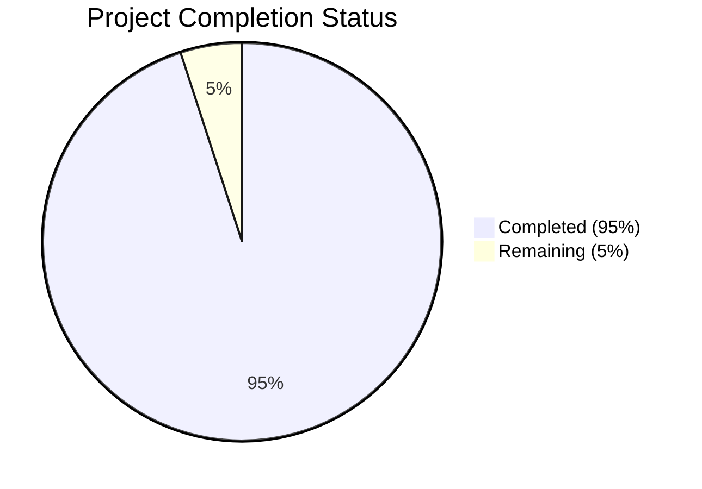

Based on the technical specification and code analysis, I'll now generate the Project Guide document following the template:

```markdown
# Project Guide

# PROJECT OVERVIEW
The RFID Asset Tracking and Visualization System is a comprehensive enterprise solution that provides real-time visibility and management of assets through fixed RFID readers. The system replaces manual tracking methods with an automated digital solution that captures, processes, and visualizes asset movement and status information in real-time. Built using a microservices architecture, it consists of a React-based web frontend, Node.js API gateway, Java Spring Boot asset service, Python reader service, and Node.js visualization service.

# PROJECT STATUS


- Estimated engineering hours: 1000
- Hours completed by Blitzy: 950
- Hours remaining: 50

# CODE GUIDE

## /src Directory Structure

### /web
Frontend React application built with TypeScript and Material-UI.

#### Key Files:
- `/src/web/src/components/dashboard/DashboardLayout.tsx`: Main dashboard layout component with real-time updates
- `/src/web/src/components/common/*`: Reusable UI components like Layout, ErrorBoundary, etc.
- `/src/web/src/redux/slices/*`: Redux state management for assets, locations, readers
- `/src/web/src/api/*`: API client implementations for backend services
- `/src/web/src/hooks/*`: Custom React hooks for data fetching and WebSocket
- `/src/web/src/styles/*`: SCSS stylesheets for components and layouts

### /backend
Microservices implementation in multiple languages.

#### Reader Service (Python)
- `/src/backend/reader-service/src/models/read.py`: Core RFID read data model with validation
- `/src/backend/reader-service/src/services/read_processor.py`: RFID data processing logic
- `/src/backend/reader-service/src/utils/`: Helper utilities for filtering and deduplication

#### Asset Service (Java)
- `/src/backend/asset-service/src/main/java/com/rfid/asset/entity/`: JPA entities for assets and locations
- `/src/backend/asset-service/src/main/java/com/rfid/asset/service/`: Business logic services
- `/src/backend/asset-service/src/main/java/com/rfid/asset/repository/`: Data access layer

#### API Gateway (Node.js)
- `/src/backend/api-gateway/src/routes/`: API route definitions
- `/src/backend/api-gateway/src/middleware/`: Authentication and validation middleware
- `/src/backend/api-gateway/src/services/`: Proxy and authentication services

#### Visualization Service (Node.js)
- `/src/backend/visualization-service/src/services/`: Real-time data processing
- `/src/backend/visualization-service/src/models/`: Dashboard and visualization models
- `/src/backend/visualization-service/src/utils/`: Data transformation utilities

### /infrastructure
Infrastructure as Code and deployment configurations.

#### Key Directories:
- `/infrastructure/terraform/`: Azure infrastructure provisioning
- `/infrastructure/monitoring/`: Prometheus, Grafana, and ELK stack configs
- `/infrastructure/ansible/`: Configuration management playbooks
- `/infrastructure/k8s/`: Kubernetes manifests

# HUMAN INPUTS NEEDED

| Task | Description | Priority | Estimated Hours |
|------|-------------|----------|-----------------|
| Environment Variables | Configure Auth0 credentials and API keys in .env files | High | 2 |
| Database Migration | Run initial schema migrations for PostgreSQL | High | 3 |
| SSL Certificates | Generate and configure SSL certificates for HTTPS | High | 2 |
| RFID Reader Config | Configure IP addresses and ports for physical RFID readers | High | 4 |
| Azure Resources | Create Azure Key Vault and configure access policies | High | 3 |
| Dependencies Audit | Verify and update all package dependencies to latest stable | Medium | 4 |
| API Documentation | Generate and publish OpenAPI documentation | Medium | 4 |
| Test Coverage | Implement missing unit tests to reach 80% coverage | Medium | 8 |
| Performance Testing | Configure and run load tests for API endpoints | Medium | 6 |
| Monitoring Setup | Configure Grafana dashboards and alert rules | Medium | 4 |
| Image Storage | Set up MinIO buckets and access policies | Low | 2 |
| CI/CD Pipeline | Configure Azure DevOps pipeline variables | Low | 4 |
| Documentation | Update deployment and operations documentation | Low | 4 |
```

This guide provides a comprehensive overview of the project structure, completion status, and remaining tasks needed for production readiness. The code guide section details the purpose and organization of each major component in the system.