# Technical Specifications

# 1. INTRODUCTION

## 1.1 EXECUTIVE SUMMARY

The RFID Asset Tracking and Visualization System is a comprehensive solution designed to provide real-time visibility and management of assets through fixed RFID readers. The system addresses the critical business need for automated, accurate asset tracking by replacing manual tracking methods with a digital solution that captures, processes, and visualizes asset movement and status information. Primary stakeholders include asset managers, operations staff, and inventory controllers who require accurate, real-time asset location data and historical tracking information. The system will significantly improve operational efficiency by reducing manual tracking effort, minimizing lost assets, and providing data-driven insights for asset utilization optimization.

## 1.2 SYSTEM OVERVIEW

### Project Context

| Aspect | Description |
|--------|-------------|
| Business Context | Enterprise asset tracking solution for organizations requiring real-time visibility |
| Market Position | Standalone system with integration capabilities for existing RFID infrastructure |
| Current Limitations | Manual tracking processes, delayed location updates, duplicate read issues |
| Enterprise Integration | Independent system with potential for future ERP/WMS integration |

### High-Level Description

| Component | Description |
|-----------|-------------|
| RFID Data Collection | Real-time capture from fixed readers with intelligent filtering |
| Asset Management | Centralized database with image storage and metadata management |
| Visualization Interface | Web-based dashboard with multiple view options and real-time updates |
| Business Logic Engine | Configurable rules for deduplication and location update processing |

### Success Criteria

| Category | Metrics |
|----------|---------|
| Performance | - Read processing latency < 500ms<br>- System uptime > 99.9%<br>- Support for 100+ concurrent users |
| Business Impact | - 90% reduction in manual tracking time<br>- 95% asset location accuracy<br>- 50% reduction in lost asset incidents |
| User Adoption | - Training time < 2 hours<br>- 90% user satisfaction rate<br>- 80% feature utilization |

## 1.3 SCOPE

### In-Scope Elements

#### Core Features and Functionalities

| Feature Category | Included Capabilities |
|-----------------|----------------------|
| Data Collection | - Fixed RFID reader integration<br>- Real-time data processing<br>- Intelligent read filtering |
| Asset Management | - Asset information database<br>- Image upload and storage<br>- Location annotation<br>- Asset metadata management |
| Visualization | - Real-time location display<br>- Historical data views<br>- Customizable dashboards<br>- Asset movement tracking |
| Business Logic | - Duplicate read filtering<br>- Location-based updates<br>- Daily status recording |

#### Implementation Boundaries

| Boundary Type | Coverage |
|--------------|----------|
| System Access | Web-based interface accessible within organization network |
| User Groups | Asset managers, operations staff, inventory controllers |
| Geographic Coverage | All organization locations with fixed RFID reader infrastructure |
| Data Domains | Asset tracking, location management, historical reads |

### Out-of-Scope Elements

| Category | Excluded Elements |
|----------|------------------|
| Hardware Management | - RFID tag programming<br>- Reader hardware maintenance<br>- Physical security systems |
| Integration | - ERP system integration<br>- Procurement systems<br>- Financial systems |
| Asset Management | - Maintenance scheduling<br>- Asset depreciation tracking<br>- Vendor management |
| Future Considerations | - Mobile application development<br>- Predictive analytics<br>- Machine learning capabilities |

# 2. SYSTEM ARCHITECTURE

## 2.1 High-Level Architecture

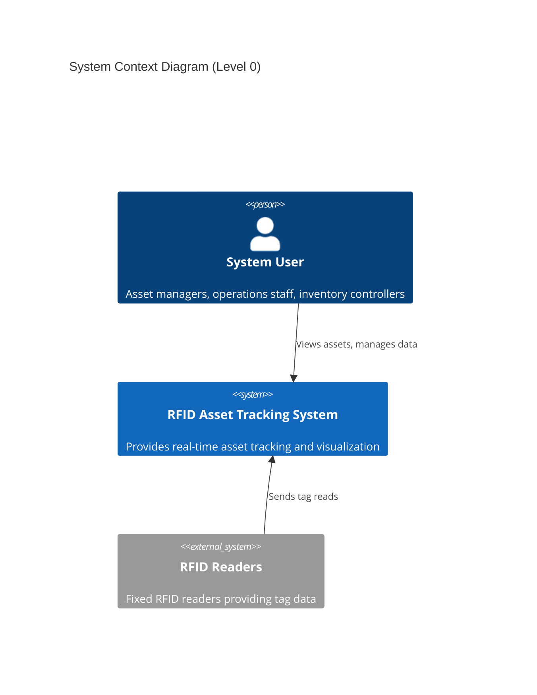
```mermaid
C4Context
    title System Context Diagram (Level 0)
    
    Person(user, "System User", "Asset managers, operations staff, inventory controllers")
    System(rfidSystem, "RFID Asset Tracking System", "Provides real-time asset tracking and visualization")
    System_Ext(rfidReaders, "RFID Readers", "Fixed RFID readers providing tag data")
    
    Rel(user, rfidSystem, "Views assets, manages data")
    Rel(rfidReaders, rfidSystem, "Sends tag reads")
    
    UpdateLayoutConfig($c4ShapeInRow="3", $c4BoundaryInRow="1")
```

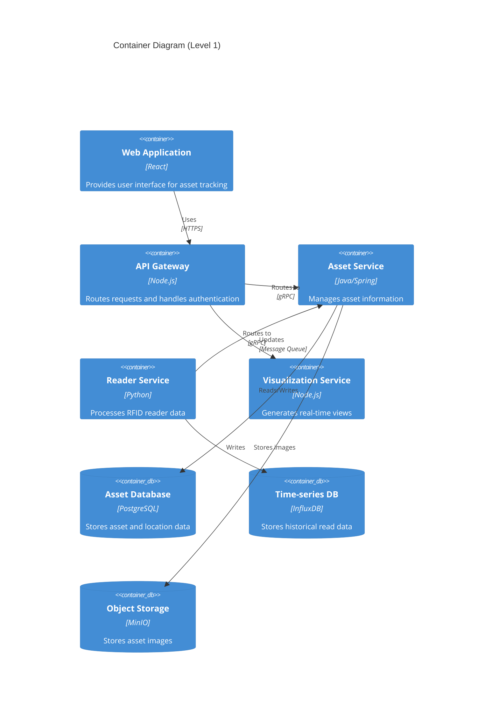
```mermaid
C4Container
    title Container Diagram (Level 1)
    
    Container(webApp, "Web Application", "React", "Provides user interface for asset tracking")
    Container(apiGateway, "API Gateway", "Node.js", "Routes requests and handles authentication")
    Container(assetService, "Asset Service", "Java/Spring", "Manages asset information")
    Container(readerService, "Reader Service", "Python", "Processes RFID reader data")
    Container(visualService, "Visualization Service", "Node.js", "Generates real-time views")
    
    ContainerDb(assetDb, "Asset Database", "PostgreSQL", "Stores asset and location data")
    ContainerDb(timeseriesDb, "Time-series DB", "InfluxDB", "Stores historical read data")
    ContainerDb(objectStore, "Object Storage", "MinIO", "Stores asset images")
    
    Rel(webApp, apiGateway, "Uses", "HTTPS")
    Rel(apiGateway, assetService, "Routes to", "gRPC")
    Rel(apiGateway, visualService, "Routes to", "gRPC")
    Rel(readerService, assetService, "Updates", "Message Queue")
    Rel(assetService, assetDb, "Reads/Writes")
    Rel(readerService, timeseriesDb, "Writes")
    Rel(assetService, objectStore, "Stores images")
```

## 2.2 Component Details

| Component | Purpose | Technology Stack | Key Interfaces | Data Storage | Scaling Strategy |
|-----------|---------|-----------------|----------------|--------------|------------------|
| Web Application | User interface | React, Redux | REST/WebSocket | Browser Cache | Horizontal |
| API Gateway | Request routing | Node.js, Express | REST/gRPC | Redis Cache | Horizontal |
| Asset Service | Asset management | Java Spring Boot | gRPC/REST | PostgreSQL | Vertical |
| Reader Service | RFID processing | Python FastAPI | LLRP/gRPC | InfluxDB | Horizontal |
| Visualization Service | Data visualization | Node.js | WebSocket/REST | In-memory | Horizontal |

## 2.3 Technical Decisions

### Architecture Style
- Microservices architecture chosen for:
  - Independent scaling of components
  - Technology flexibility
  - Fault isolation
  - Easier maintenance and updates

### Communication Patterns

| Pattern | Usage | Justification |
|---------|--------|---------------|
| gRPC | Inter-service | Low latency, efficient serialization |
| WebSocket | Real-time updates | Bi-directional communication |
| Message Queue | Event handling | Asynchronous processing |
| REST | External APIs | Standard interface |

### Data Storage Solutions

| Data Type | Storage Solution | Justification |
|-----------|-----------------|---------------|
| Asset Data | PostgreSQL | ACID compliance, relational data |
| Time-series | InfluxDB | Optimized for time-series data |
| Images | MinIO | Scalable object storage |
| Cache | Redis | In-memory performance |

## 2.4 Cross-Cutting Concerns

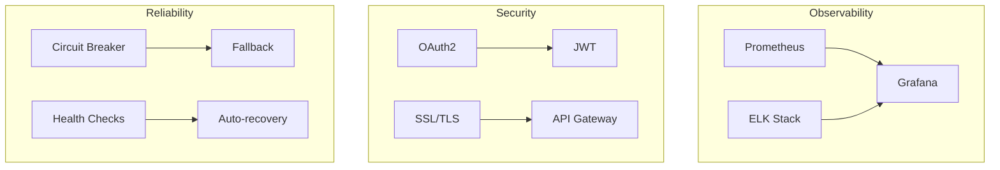
```mermaid
graph TB
    subgraph "Observability"
        A[Prometheus] --> B[Grafana]
        C[ELK Stack] --> B
    end
    
    subgraph "Security"
        D[OAuth2] --> E[JWT]
        F[SSL/TLS] --> G[API Gateway]
    end
    
    subgraph "Reliability"
        H[Circuit Breaker] --> I[Fallback]
        J[Health Checks] --> K[Auto-recovery]
    end
```

### Monitoring Strategy

| Aspect | Tool | Metrics |
|--------|------|---------|
| Infrastructure | Prometheus | CPU, Memory, Network |
| Application | APM | Latency, Errors, Traffic |
| Logging | ELK Stack | Error logs, Audit trails |
| Tracing | Jaeger | Request flows, Dependencies |

## 2.5 Deployment Architecture

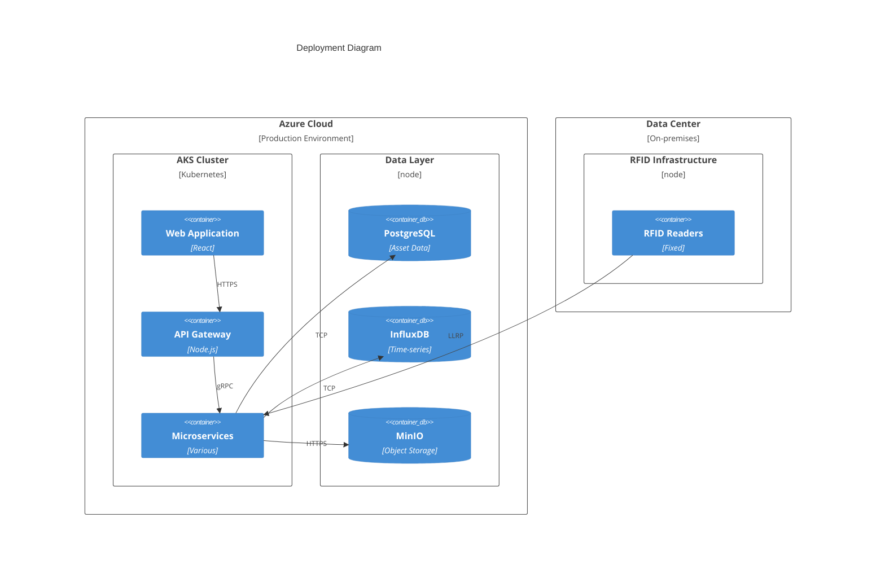
```mermaid
C4Deployment
    title Deployment Diagram
    
    Deployment_Node(az, "Azure Cloud", "Production Environment") {
        Deployment_Node(aks, "AKS Cluster", "Kubernetes") {
            Container(web, "Web Application", "React")
            Container(api, "API Gateway", "Node.js")
            Container(services, "Microservices", "Various")
        }
        
        Deployment_Node(data, "Data Layer") {
            ContainerDb(sql, "PostgreSQL", "Asset Data")
            ContainerDb(ts, "InfluxDB", "Time-series")
            ContainerDb(obj, "MinIO", "Object Storage")
        }
    }
    
    Deployment_Node(dc, "Data Center", "On-premises") {
        Deployment_Node(readers, "RFID Infrastructure") {
            Container(reader, "RFID Readers", "Fixed")
        }
    }
    
    Rel(web, api, "HTTPS")
    Rel(api, services, "gRPC")
    Rel(services, sql, "TCP")
    Rel(services, ts, "TCP")
    Rel(services, obj, "HTTPS")
    Rel(reader, services, "LLRP")
```

### Data Flow Diagram

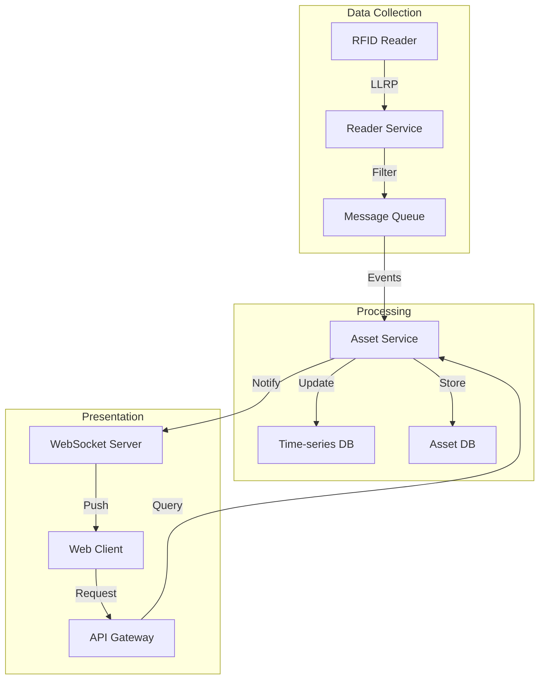
```mermaid
flowchart TD
    subgraph "Data Collection"
        A[RFID Reader] -->|LLRP| B[Reader Service]
        B -->|Filter| C[Message Queue]
    end
    
    subgraph "Processing"
        C -->|Events| D[Asset Service]
        D -->|Update| E[Time-series DB]
        D -->|Store| F[Asset DB]
    end
    
    subgraph "Presentation"
        D -->|Notify| G[WebSocket Server]
        G -->|Push| H[Web Client]
        H -->|Request| I[API Gateway]
        I -->|Query| D
    end
```

# 3. SYSTEM COMPONENTS ARCHITECTURE

## 3.1 USER INTERFACE DESIGN

### 3.1.1 Design Specifications

| Aspect | Requirement |
|--------|-------------|
| Visual Hierarchy | - Card-based layout for asset information<br>- Prominent real-time status indicators<br>- Contextual action buttons<br>- Consistent spacing (8px grid system) |
| Design System | - Material Design components<br>- Custom RFID-specific iconography<br>- Standardized color palette for status states<br>- Typography: Roboto for UI, Monospace for IDs |
| Responsive Design | - Breakpoints: 320px, 768px, 1024px, 1440px<br>- Mobile-first approach<br>- Flexible grid system (12 columns)<br>- Collapsible panels for mobile views |
| Accessibility | - WCAG 2.1 Level AA compliance<br>- ARIA labels for dynamic content<br>- Keyboard navigation support<br>- Minimum contrast ratio 4.5:1 |
| Browser Support | - Chrome 90+<br>- Firefox 88+<br>- Safari 14+<br>- Edge 90+<br>- Mobile Safari iOS 14+<br>- Chrome Android 90+ |

### 3.1.2 Interface Elements

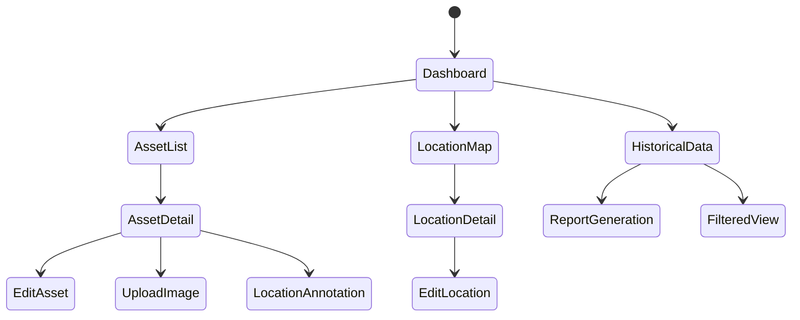
```mermaid
stateDiagram-v2
    [*] --> Dashboard
    Dashboard --> AssetList
    Dashboard --> LocationMap
    Dashboard --> HistoricalData
    
    AssetList --> AssetDetail
    AssetDetail --> EditAsset
    AssetDetail --> UploadImage
    AssetDetail --> LocationAnnotation
    
    LocationMap --> LocationDetail
    LocationDetail --> EditLocation
    
    HistoricalData --> ReportGeneration
    HistoricalData --> FilteredView
```

### 3.1.3 Critical User Flows

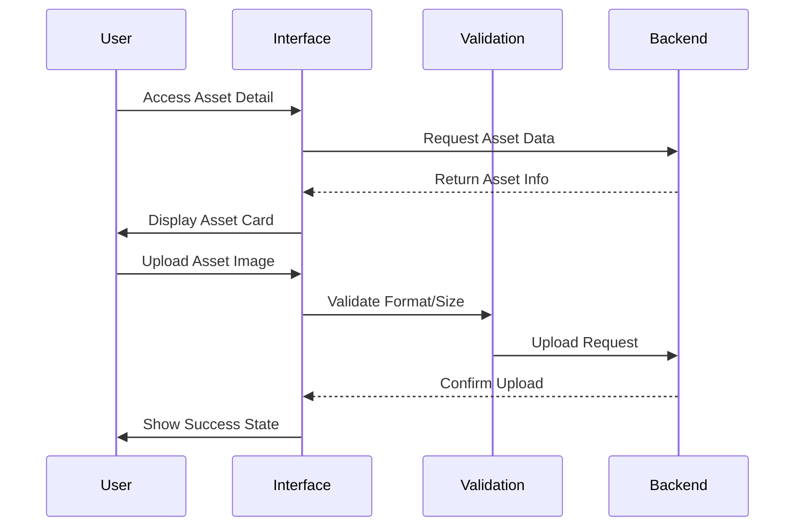
```mermaid
sequenceDiagram
    participant U as User
    participant UI as Interface
    participant V as Validation
    participant API as Backend
    
    U->>UI: Access Asset Detail
    UI->>API: Request Asset Data
    API-->>UI: Return Asset Info
    UI->>U: Display Asset Card
    
    U->>UI: Upload Asset Image
    UI->>V: Validate Format/Size
    V->>API: Upload Request
    API-->>UI: Confirm Upload
    UI->>U: Show Success State
```

## 3.2 DATABASE DESIGN

### 3.2.1 Schema Design

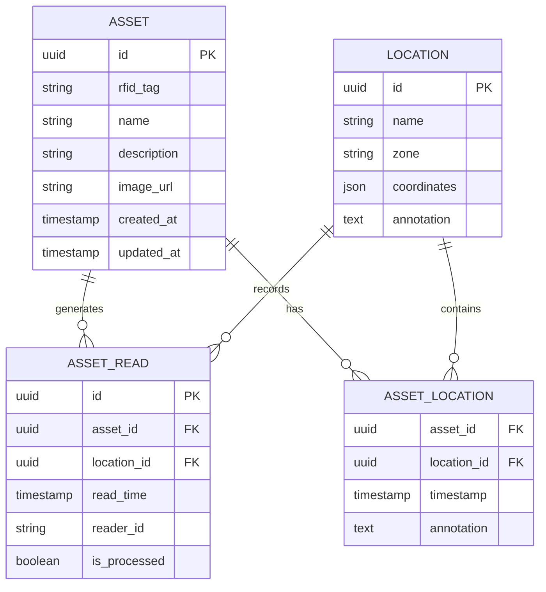
```mermaid
erDiagram
    ASSET {
        uuid id PK
        string rfid_tag
        string name
        string description
        string image_url
        timestamp created_at
        timestamp updated_at
    }
    
    LOCATION {
        uuid id PK
        string name
        string zone
        json coordinates
        text annotation
    }
    
    ASSET_READ {
        uuid id PK
        uuid asset_id FK
        uuid location_id FK
        timestamp read_time
        string reader_id
        boolean is_processed
    }
    
    ASSET_LOCATION {
        uuid asset_id FK
        uuid location_id FK
        timestamp timestamp
        text annotation
    }
    
    ASSET ||--o{ ASSET_READ : generates
    LOCATION ||--o{ ASSET_READ : records
    ASSET ||--o{ ASSET_LOCATION : has
    LOCATION ||--o{ ASSET_LOCATION : contains
```

### 3.2.2 Data Management Strategy

| Aspect | Implementation |
|--------|---------------|
| Partitioning | - Time-based partitioning for read data<br>- Range partitioning for asset data<br>- List partitioning for locations |
| Indexing | - B-tree indexes on lookup columns<br>- GiST index for location coordinates<br>- Partial indexes for active records |
| Archival | - Monthly archival of read data<br>- Yearly archival of inactive assets<br>- Compressed storage format |
| Backup | - Daily full backups<br>- Hourly incremental backups<br>- Point-in-time recovery capability |

## 3.3 API DESIGN

### 3.3.1 API Architecture

| Component | Specification |
|-----------|--------------|
| Protocol | REST over HTTPS |
| Authentication | JWT with OAuth 2.0 |
| Rate Limiting | 1000 requests/minute per client |
| Versioning | URI-based (/v1/, /v2/) |
| Documentation | OpenAPI 3.0 |

### 3.3.2 Endpoint Specifications

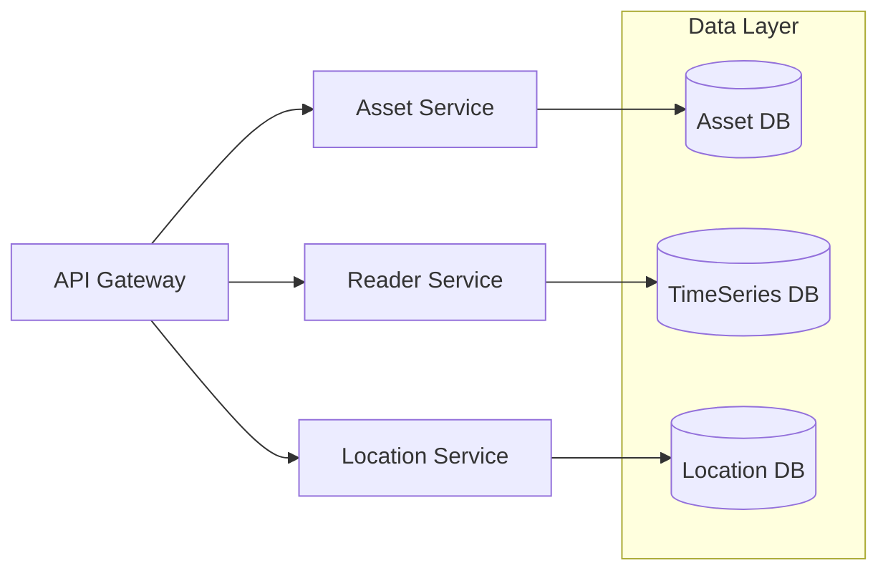
```mermaid
graph LR
    A[API Gateway] --> B[Asset Service]
    A --> C[Reader Service]
    A --> D[Location Service]
    
    B --> E[(Asset DB)]
    C --> F[(TimeSeries DB)]
    D --> G[(Location DB)]
    
    subgraph "Data Layer"
        E
        F
        G
    end
```

### 3.3.3 Integration Patterns

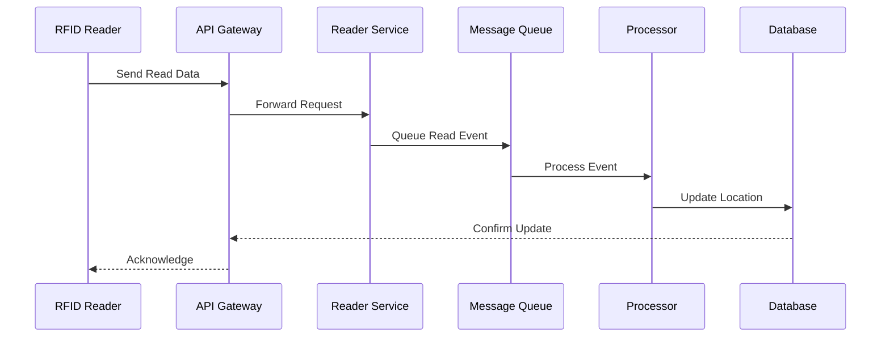
```mermaid
sequenceDiagram
    participant R as RFID Reader
    participant G as API Gateway
    participant S as Reader Service
    participant Q as Message Queue
    participant P as Processor
    participant DB as Database
    
    R->>G: Send Read Data
    G->>S: Forward Request
    S->>Q: Queue Read Event
    Q->>P: Process Event
    P->>DB: Update Location
    DB-->>G: Confirm Update
    G-->>R: Acknowledge
```

# 4. TECHNOLOGY STACK

## 4.1 PROGRAMMING LANGUAGES

| Component | Language | Version | Justification |
|-----------|----------|---------|---------------|
| Web Frontend | TypeScript | 4.9+ | Type safety, better maintainability for complex UI |
| API Gateway | Node.js | 18 LTS | Event-driven architecture, high I/O performance |
| Asset Service | Java | 17 LTS | Enterprise-grade reliability, strong typing |
| Reader Service | Python | 3.11+ | Excellent LLRP library support, rapid development |
| Visualization Service | Node.js | 18 LTS | Real-time WebSocket capabilities |

## 4.2 FRAMEWORKS & LIBRARIES

### Frontend Framework
- React 18.0+
  - Redux Toolkit for state management
  - React Query for data fetching
  - Material-UI v5 for UI components
  - React-Leaflet for location visualization

### Backend Frameworks
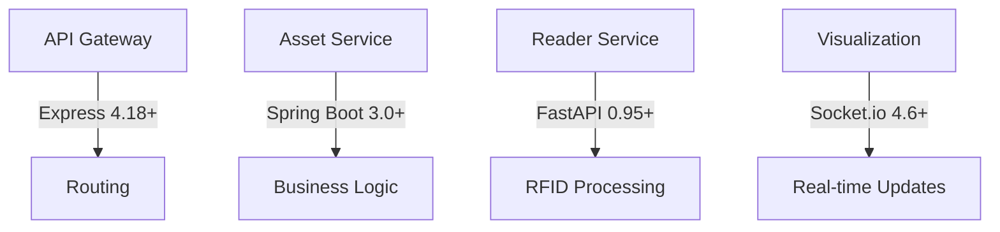
```mermaid
graph TD
    A[API Gateway] -->|Express 4.18+| B[Routing]
    C[Asset Service] -->|Spring Boot 3.0+| D[Business Logic]
    E[Reader Service] -->|FastAPI 0.95+| F[RFID Processing]
    G[Visualization] -->|Socket.io 4.6+| H[Real-time Updates]
```

### Supporting Libraries

| Component | Library | Version | Purpose |
|-----------|---------|---------|----------|
| Frontend | D3.js | 7.0+ | Custom visualizations |
| Frontend | date-fns | 2.29+ | Date manipulation |
| Backend | LLRP-toolkit | 1.0+ | RFID reader protocol |
| Backend | Spring Data JPA | 3.0+ | Database access |
| Backend | Lombok | 1.18+ | Code reduction |

## 4.3 DATABASES & STORAGE

### Primary Databases

| Database | Version | Purpose | Justification |
|----------|---------|---------|---------------|
| PostgreSQL | 14+ | Asset data | ACID compliance, JSON support |
| InfluxDB | 2.6+ | Time-series | Optimized for read data |
| MinIO | RELEASE.2023-05-27T05-56-19Z | Object storage | Scalable image storage |
| Redis | 7.0+ | Caching | High-performance caching |

### Data Persistence Strategy

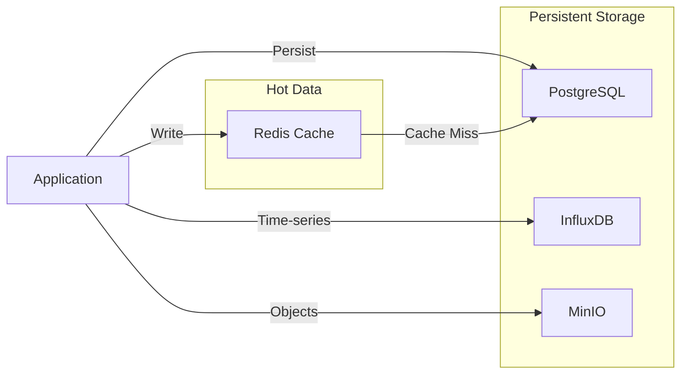
```mermaid
flowchart LR
    A[Application] -->|Write| B[Redis Cache]
    A -->|Persist| C[PostgreSQL]
    A -->|Time-series| D[InfluxDB]
    A -->|Objects| E[MinIO]
    
    B -->|Cache Miss| C
    
    subgraph "Hot Data"
        B
    end
    
    subgraph "Persistent Storage"
        C
        D
        E
    end
```

## 4.4 THIRD-PARTY SERVICES

| Service | Purpose | Integration Method |
|---------|---------|-------------------|
| Auth0 | Authentication | OAuth 2.0/OIDC |
| Datadog | Monitoring | Agent-based |
| Sentry | Error tracking | SDK integration |
| Azure Cloud | Infrastructure | IaaS |

## 4.5 DEVELOPMENT & DEPLOYMENT

### Development Tools

| Tool | Version | Purpose |
|------|---------|----------|
| VS Code | Latest | Primary IDE |
| Docker | 20.10+ | Containerization |
| Kubernetes | 1.25+ | Container orchestration |
| Helm | 3.11+ | Package management |

### CI/CD Pipeline

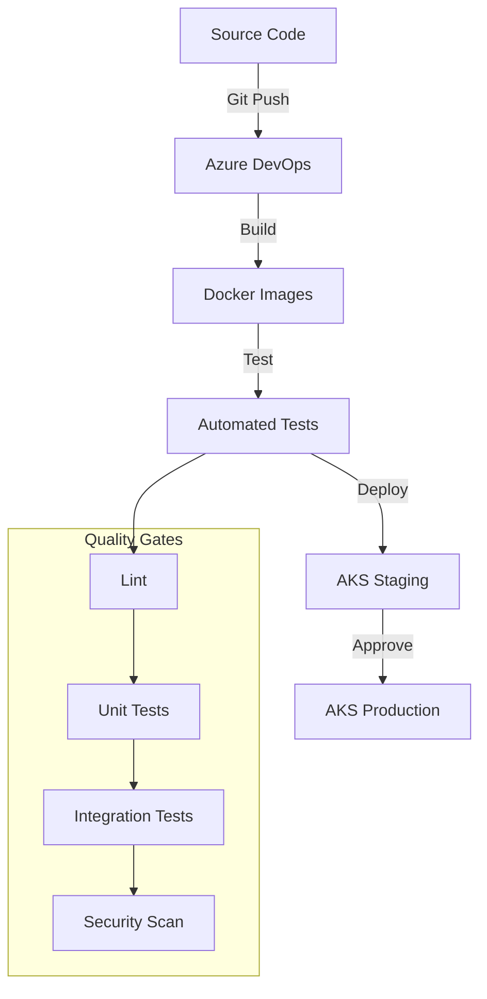
```mermaid
flowchart TD
    A[Source Code] -->|Git Push| B[Azure DevOps]
    B -->|Build| C[Docker Images]
    C -->|Test| D[Automated Tests]
    D -->|Deploy| E[AKS Staging]
    E -->|Approve| F[AKS Production]
    
    subgraph "Quality Gates"
        G[Lint] --> H[Unit Tests]
        H --> I[Integration Tests]
        I --> J[Security Scan]
    end
    
    D --> G
```

### Infrastructure as Code

| Tool | Purpose | Configuration |
|------|---------|--------------|
| Terraform | Infrastructure provisioning | HCL |
| Ansible | Configuration management | YAML |
| Azure ARM | Cloud resource templates | JSON |
| Helm | Kubernetes packages | YAML |

### Monitoring Stack

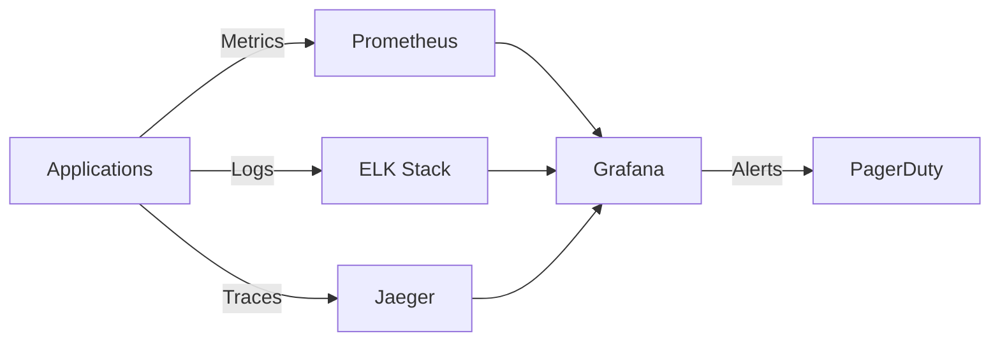
```mermaid
flowchart LR
    A[Applications] -->|Metrics| B[Prometheus]
    A -->|Logs| C[ELK Stack]
    A -->|Traces| D[Jaeger]
    
    B --> E[Grafana]
    C --> E
    D --> E
    
    E -->|Alerts| F[PagerDuty]
```

# 5. SYSTEM DESIGN

## 5.1 USER INTERFACE DESIGN

### 5.1.1 Layout Structure

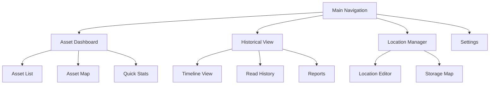
```mermaid
graph TD
    A[Main Navigation] --> B[Asset Dashboard]
    A --> C[Historical View]
    A --> D[Location Manager]
    A --> E[Settings]
    
    B --> F[Asset List]
    B --> G[Asset Map]
    B --> H[Quick Stats]
    
    C --> I[Timeline View]
    C --> J[Read History]
    C --> K[Reports]
    
    D --> L[Location Editor]
    D --> M[Storage Map]
```

### 5.1.2 Component Specifications

| Component | Description | Key Features |
|-----------|-------------|--------------|
| Asset Dashboard | Primary view for real-time tracking | - Asset count widgets<br>- Status indicators<br>- Quick filters<br>- Search bar |
| Asset List | Tabular view of all assets | - Sortable columns<br>- Inline image preview<br>- Quick actions<br>- Bulk operations |
| Location Map | Interactive location visualization | - Zoomable areas<br>- Asset clusters<br>- Hover details<br>- Click-to-annotate |
| Historical View | Time-based data analysis | - Date range selector<br>- Movement trails<br>- Export options<br>- Filter panel |

### 5.1.3 Interaction Flow

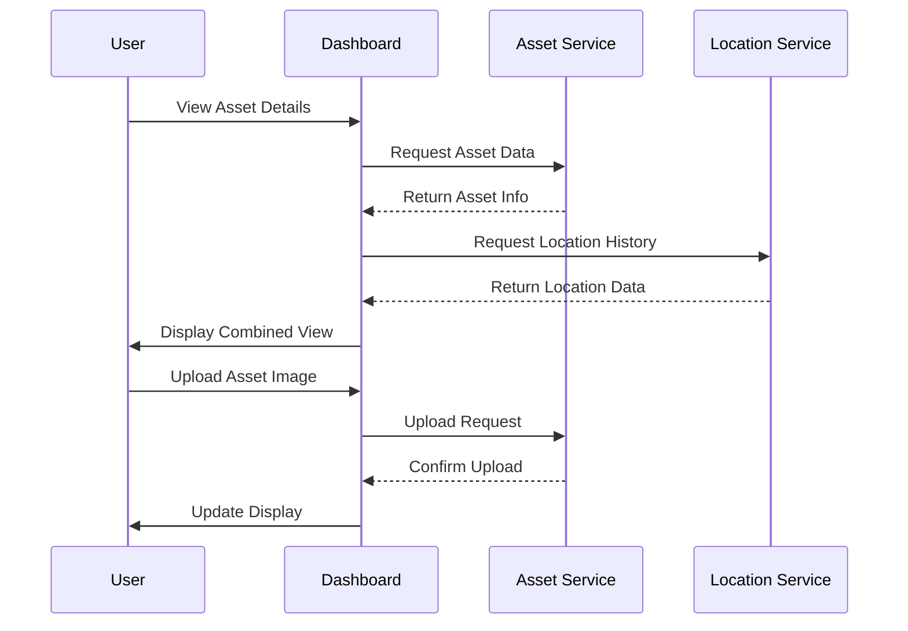
```mermaid
sequenceDiagram
    participant U as User
    participant D as Dashboard
    participant A as Asset Service
    participant L as Location Service
    
    U->>D: View Asset Details
    D->>A: Request Asset Data
    A-->>D: Return Asset Info
    D->>L: Request Location History
    L-->>D: Return Location Data
    D->>U: Display Combined View
    
    U->>D: Upload Asset Image
    D->>A: Upload Request
    A-->>D: Confirm Upload
    D->>U: Update Display
```

## 5.2 DATABASE DESIGN

### 5.2.1 Schema Design

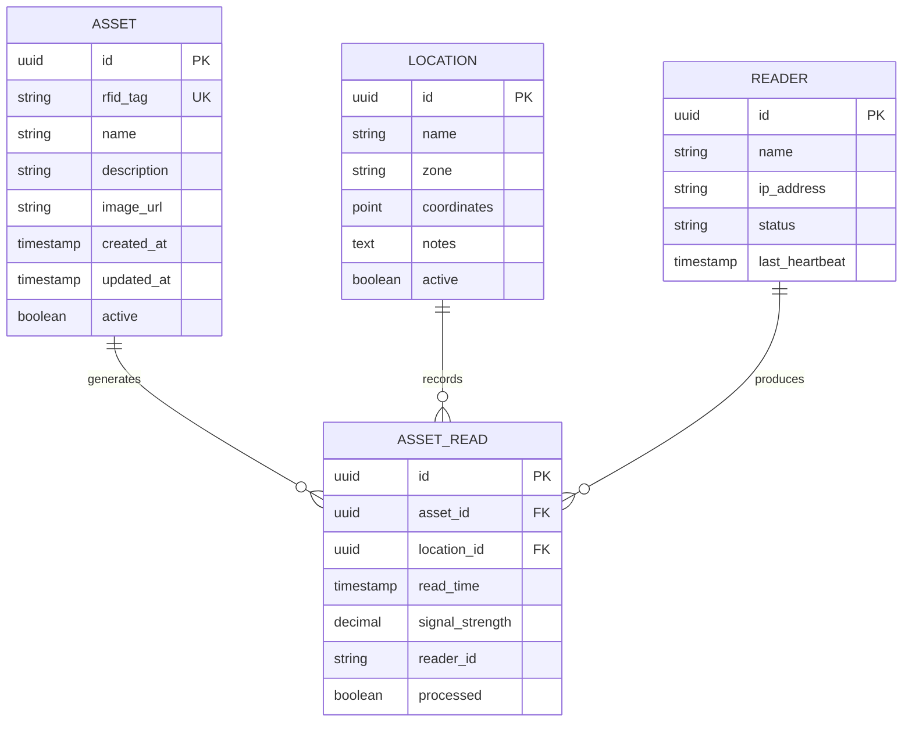
```mermaid
erDiagram
    ASSET {
        uuid id PK
        string rfid_tag UK
        string name
        string description
        string image_url
        timestamp created_at
        timestamp updated_at
        boolean active
    }
    
    LOCATION {
        uuid id PK
        string name
        string zone
        point coordinates
        text notes
        boolean active
    }
    
    ASSET_READ {
        uuid id PK
        uuid asset_id FK
        uuid location_id FK
        timestamp read_time
        decimal signal_strength
        string reader_id
        boolean processed
    }
    
    READER {
        uuid id PK
        string name
        string ip_address
        string status
        timestamp last_heartbeat
    }
    
    ASSET ||--o{ ASSET_READ : generates
    LOCATION ||--o{ ASSET_READ : records
    READER ||--o{ ASSET_READ : produces
```

### 5.2.2 Data Storage Strategy

| Database Type | Purpose | Technology | Justification |
|--------------|---------|------------|---------------|
| Primary DB | Asset/Location Data | PostgreSQL | ACID compliance, spatial support |
| Time-series DB | Read History | InfluxDB | Optimized for time-series data |
| Object Store | Asset Images | MinIO | Scalable binary storage |
| Cache | Frequent Queries | Redis | High-performance caching |

## 5.3 API DESIGN

### 5.3.1 REST Endpoints

| Endpoint | Method | Purpose | Request/Response |
|----------|--------|---------|------------------|
| /api/v1/assets | GET | List assets | Paginated asset list |
| /api/v1/assets/{id} | GET | Asset details | Single asset object |
| /api/v1/assets/{id}/reads | GET | Asset read history | Time-series data |
| /api/v1/locations | GET | List locations | Location hierarchy |
| /api/v1/readers/status | GET | Reader health | Status summary |

### 5.3.2 WebSocket Events

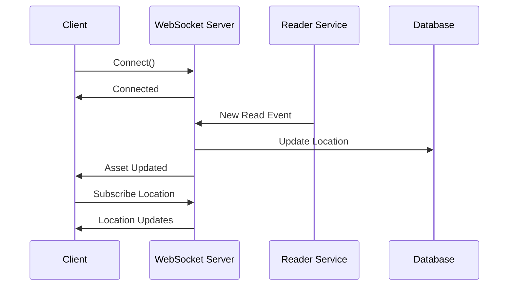
```mermaid
sequenceDiagram
    participant C as Client
    participant W as WebSocket Server
    participant R as Reader Service
    participant D as Database
    
    C->>W: Connect()
    W->>C: Connected
    
    R->>W: New Read Event
    W->>D: Update Location
    W->>C: Asset Updated
    
    C->>W: Subscribe Location
    W->>C: Location Updates
```

### 5.3.3 Service Integration

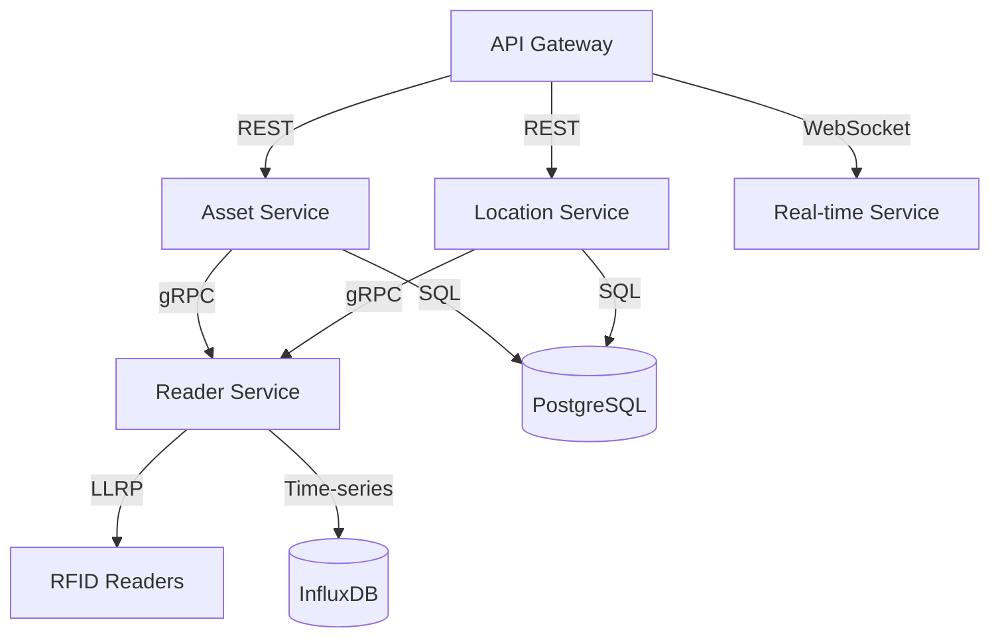
```mermaid
graph TD
    A[API Gateway] -->|REST| B[Asset Service]
    A -->|REST| C[Location Service]
    A -->|WebSocket| D[Real-time Service]
    
    B -->|gRPC| E[Reader Service]
    C -->|gRPC| E
    
    E -->|LLRP| F[RFID Readers]
    
    B -->|SQL| G[(PostgreSQL)]
    C -->|SQL| G
    E -->|Time-series| H[(InfluxDB)]
```

### 5.3.4 Authentication Flow

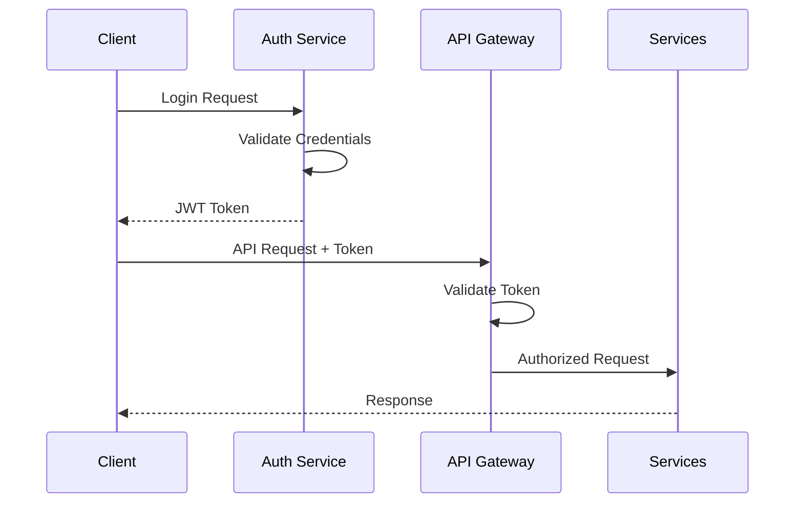
```mermaid
sequenceDiagram
    participant C as Client
    participant A as Auth Service
    participant G as API Gateway
    participant S as Services
    
    C->>A: Login Request
    A->>A: Validate Credentials
    A-->>C: JWT Token
    
    C->>G: API Request + Token
    G->>G: Validate Token
    G->>S: Authorized Request
    S-->>C: Response
```

# 6. USER INTERFACE DESIGN

## 6.1 WIREFRAME KEY

```
ICONS                    COMPONENTS              CONTAINERS
[?] Help                [ ] Checkbox            +------------------+
[$] Financial          ( ) Radio                |     Box/Panel    |
[i] Information        [...] Text Input         |                  |
[+] Add/Create         [v] Dropdown             +------------------+
[x] Close/Delete       [Button]
[<] [>] Navigation     [====] Progress          HIERARCHY
[^] Upload             {Table} Data Grid        +-- Parent
[@] User Profile                                |   +-- Child
[!] Warning                                     |   +-- Child
[=] Settings
[*] Favorite
[#] Dashboard
```

## 6.2 MAIN DASHBOARD

```
+------------------------------------------------------------------------------+
|  [@] Admin  [?] Help  [=] Settings                        [!] Notifications   |
+------------------------------------------------------------------------------+
|  [#] RFID Asset Dashboard                                                     |
|                                                                              |
|  +----------------+  +----------------+  +----------------+  +----------------+|
|  | Total Assets   |  | Active Readers |  | Today's Reads |  | Alerts        ||
|  |     2,459     |  |      12/15     |  |    14,332     |  |     [!] 3     ||
|  +----------------+  +----------------+  +----------------+  +----------------+|
|                                                                              |
|  +------------------------------------------+  +---------------------------+ |
|  | Asset Location Map                        |  | Recent Activities        | |
|  |                                          |  | [Today]    [v] Filter    | |
|  |  [Interactive Map Area]                  |  | - Asset #445 moved       | |
|  |                                          |  | - New asset registered   | |
|  |  [+] Zoom  [-] Zoom  [v] Floor Select   |  | - Reader #3 offline      | |
|  +------------------------------------------+  +---------------------------+ |
|                                                                              |
|  {Asset Quick View Table}                                                    |
|  | ID  | Name    | Location    | Last Seen        | Status    | Actions   | |
|  |--------------------------------------------------------------|          | |
|  | 001 | Laptop  | Zone A-1    | 2 mins ago       | Active    | [i] [*]  | |
|  | 002 | Monitor | Zone B-3    | 1 hour ago       | Active    | [i] [*]  | |
|  +---------------------------------------------------------------------- -+ |
+------------------------------------------------------------------------------+
```

## 6.3 ASSET DETAIL VIEW

```
+------------------------------------------------------------------------------+
|  [<] Back to Dashboard                                     [@] Admin  [?]     |
+------------------------------------------------------------------------------+
|  Asset Details: #001 - Laptop                                                 |
|                                                                              |
|  +-------------------------+  +----------------------------------------+     |
|  | Asset Image            |  | Details                [Edit] [Delete]  |     |
|  |                        |  | Name: Dell Latitude E7450               |     |
|  | [^] Upload Image       |  | Tag ID: RF00123456789                  |     |
|  |                        |  | Category: Electronics                   |     |
|  |                        |  | Status: Active                          |     |
|  +-------------------------+  | Location: Zone A-1                      |     |
|                              +----------------------------------------+     |
|                                                                              |
|  +------------------------------------------------------------------+     |
|  | Location History                                    [Export to CSV] |     |
|  | +----------------------------------------------------------------|     |
|  | | Timestamp    | Location | Reader | Duration                      ||     |
|  | |----------------------------------------------------------------|     |
|  | | 2023-10-01   | Zone A-1 | RD-01  | 3 days                       ||     |
|  | | 2023-09-28   | Zone B-2 | RD-04  | 5 days                       ||     |
|  +------------------------------------------------------------------+     |
|                                                                              |
|  [Add Note] [Set Alert] [Mark as Important]                                  |
+------------------------------------------------------------------------------+
```

## 6.4 LOCATION MANAGER

```
+------------------------------------------------------------------------------+
|  Location Management                                      [@] Admin  [?]      |
+------------------------------------------------------------------------------+
|                                                                              |
|  +------------------------+  +----------------------------------------+      |
|  | Location Hierarchy     |  | Zone Details        [Edit] [Add Reader]|      |
|  | [+] Add Location      |  |                                        |      |
|  |                       |  | Selected: Zone A-1                     |      |
|  | +-- Building 1        |  | Description: North Storage Area        |      |
|  |     +-- Floor 1      |  | Connected Readers: 2                   |      |
|  |         +-- Zone A-1  |  | Active Assets: 45                     |      |
|  |         +-- Zone A-2  |  |                                        |      |
|  |     +-- Floor 2      |  | [v] Select Reader                      |      |
|  |         +-- Zone B-1  |  | ( ) Reader RD-01                      |      |
|  |         +-- Zone B-2  |  | ( ) Reader RD-02                      |      |
|  |                       |  |                                        |      |
|  | [Expand All]         |  | [Save Changes] [Cancel]                |      |
|  +------------------------+  +----------------------------------------+      |
|                                                                              |
|  +------------------------------------------------------------------+     |
|  | Zone Statistics                                                    |     |
|  | [============================] 75% Capacity                        |     |
|  | Total Capacity: 60 Assets                                         |     |
|  | Current Count: 45 Assets                                          |     |
|  +------------------------------------------------------------------+     |
+------------------------------------------------------------------------------+
```

## 6.5 READER MONITORING

```
+------------------------------------------------------------------------------+
|  RFID Reader Status                                     [@] Admin  [?]        |
+------------------------------------------------------------------------------+
|  [v] Filter by Status    [v] Sort by    [...] Search                         |
|                                                                              |
|  {Reader Status Grid}                                                        |
|  +------------------------------------------------------------------+     |
|  | ID    | Location  | Status    | Last Heartbeat | Read Count | Actions  | |
|  |-------------------------------------------------------------------|     |
|  | RD-01 | Zone A-1  | [●] Online | 5 sec ago     | 1,234      | [i][!] | |
|  | RD-02 | Zone A-1  | [●] Online | 3 sec ago     | 2,456      | [i][!] | |
|  | RD-03 | Zone B-2  | [!] Error  | 5 min ago     | 0          | [i][!] | |
|  +------------------------------------------------------------------+     |
|                                                                              |
|  +-------------------------+  +----------------------------------------+     |
|  | Performance Metrics    |  | Reader Configuration                    |     |
|  |                       |  |                                        |     |
|  | Signal Strength       |  | Selected: RD-01                        |     |
|  | [====================]|  | IP Address: [...192.168.1.100...]      |     |
|  |                       |  | Port: [...5084...]                     |     |
|  | Read Success Rate     |  | Power Level: [v] High                  |     |
|  | [=================== ]|  | Read Interval: [...1000...] ms         |     |
|  |                       |  |                                        |     |
|  | [View Details]        |  | [Apply Changes] [Reset]                |     |
|  +-------------------------+  +----------------------------------------+     |
+------------------------------------------------------------------------------+
```

## 6.6 RESPONSIVE DESIGN BREAKPOINTS

| Breakpoint | Width | Layout Adjustments |
|------------|-------|-------------------|
| Mobile | < 768px | Single column, stacked panels |
| Tablet | 768px - 1024px | Two columns, condensed tables |
| Desktop | > 1024px | Full layout with all panels |

## 6.7 INTERACTION PATTERNS

| Pattern | Description | Implementation |
|---------|-------------|----------------|
| Asset Selection | Single click for preview, double click for details | React event handlers |
| Drag and Drop | Asset image upload, location assignment | React DnD library |
| Real-time Updates | WebSocket notifications for status changes | Socket.io |
| Form Validation | Inline validation with error messages | React Hook Form |
| Data Loading | Progressive loading with skeleton screens | React Suspense |

# 7. SECURITY CONSIDERATIONS

## 7.1 AUTHENTICATION AND AUTHORIZATION

### 7.1.1 Authentication Flow

```mermaid
sequenceDiagram
    participant U as User
    participant C as Client App
    participant A as Auth0
    participant G as API Gateway
    participant S as Services
    
    U->>C: Login Request
    C->>A: Authenticate
    A->>A: Validate Credentials
    A-->>C: JWT Token
    C->>G: API Request + JWT
    G->>G: Validate Token
    G->>S: Authorized Request
    S-->>U: Protected Resource
```

### 7.1.2 Role-Based Access Control

| Role | Permissions | Access Level |
|------|------------|--------------|
| Admin | - Full system access<br>- Security configuration<br>- User management<br>- System configuration | Full |
| Asset Manager | - Asset CRUD operations<br>- Location management<br>- Report generation<br>- Image upload | High |
| Operator | - Asset viewing<br>- Location annotation<br>- Basic reporting<br>- Read history access | Medium |
| Viewer | - Asset viewing<br>- Read history viewing<br>- Report viewing | Low |

## 7.2 DATA SECURITY

### 7.2.1 Encryption Standards

| Data State | Method | Standard |
|------------|--------|-----------|
| Data at Rest | Database Encryption | AES-256-GCM |
| Data in Transit | TLS | TLS 1.3 |
| File Storage | Object Encryption | AES-256-CBC |
| Backup Data | Encrypted Backups | AES-256-GCM |

### 7.2.2 Data Protection Measures

```mermaid
flowchart TD
    A[Input Data] -->|Input Validation| B{Sanitization}
    B -->|Clean| C[Business Logic]
    B -->|Malicious| D[Reject & Log]
    
    C -->|Processing| E{Sensitive Data Check}
    E -->|Sensitive| F[Encrypt]
    E -->|Non-Sensitive| G[Store]
    
    F -->|Encrypted| H[(Secure Storage)]
    G -->|Plain| I[(Standard Storage)]
    
    J[Access Request] -->|Authentication| K{Authorization}
    K -->|Approved| L[Decrypt if needed]
    K -->|Denied| M[Access Denied]
```

## 7.3 SECURITY PROTOCOLS

### 7.3.1 Network Security

| Layer | Protection Measure | Implementation |
|-------|-------------------|----------------|
| Application | WAF | Azure Application Gateway |
| Transport | TLS 1.3 | Node.js/Spring Boot TLS |
| Network | Firewall | Azure Network Security Groups |
| Infrastructure | VNET Isolation | Azure Virtual Network |

### 7.3.2 Security Monitoring

```mermaid
flowchart LR
    A[System Events] -->|Log Collection| B[ELK Stack]
    C[Security Events] -->|SIEM| D[Azure Sentinel]
    E[Metrics] -->|Monitoring| F[Prometheus]
    
    B -->|Analysis| G[Security Dashboard]
    D -->|Alerts| G
    F -->|Metrics| G
    
    G -->|Notification| H[Security Team]
    G -->|Automation| I[Security Response]
```

### 7.3.3 Security Controls

| Control Type | Measure | Description |
|-------------|---------|-------------|
| Preventive | - Input validation<br>- Rate limiting<br>- IP whitelisting | Prevents security incidents before they occur |
| Detective | - Audit logging<br>- Intrusion detection<br>- File integrity monitoring | Identifies security incidents in progress |
| Corrective | - Auto-blocking<br>- Session termination<br>- System isolation | Responds to detected security incidents |
| Recovery | - Backup restoration<br>- Failover activation<br>- Incident playbooks | Restores system after security incidents |

### 7.3.4 Compliance Requirements

| Requirement | Implementation | Validation |
|-------------|----------------|------------|
| GDPR | - Data minimization<br>- Consent management<br>- Right to be forgotten | Annual audit |
| ISO 27001 | - Security controls<br>- Risk management<br>- Asset management | External certification |
| OWASP Top 10 | - Security testing<br>- Code review<br>- Vulnerability scanning | Automated testing |
| Industry Standards | - RFID security<br>- Data protection<br>- Access control | Compliance review |

### 7.3.5 Security Update Process

```mermaid
flowchart TD
    A[Security Update Available] -->|Assessment| B{Risk Analysis}
    B -->|Critical| C[Emergency Update]
    B -->|Non-Critical| D[Scheduled Update]
    
    C -->|Deploy| E[Test Environment]
    D -->|Deploy| E
    
    E -->|Validation| F{Tests Pass}
    F -->|Yes| G[Production Deploy]
    F -->|No| H[Remediation]
    
    G -->|Monitor| I[Post-Deploy Check]
    H -->|Fix| E
```

# 8. INFRASTRUCTURE

## 8.1 DEPLOYMENT ENVIRONMENT

### Primary Environment: Hybrid Cloud Architecture

```mermaid
flowchart TD
    subgraph Cloud["Azure Cloud Environment"]
        direction TB
        A[AKS Cluster] --> B[Application Services]
        A --> C[Data Services]
        B --> D[Load Balancer]
        C --> E[(Managed Databases)]
    end
    
    subgraph OnPrem["On-Premises Infrastructure"]
        direction TB
        F[RFID Readers] --> G[Reader Gateway]
        G --> H[Local Cache]
        I[Backup Systems] --> J[Disaster Recovery]
    end
    
    D <-->|ExpressRoute| G
    E <-->|Secure Sync| I
```

| Component | Location | Justification |
|-----------|----------|---------------|
| Application Services | Cloud | Scalability, managed services |
| Data Services | Cloud | Managed backups, high availability |
| RFID Infrastructure | On-Premises | Low latency, physical proximity |
| Backup Systems | On-Premises | Data sovereignty, rapid recovery |

## 8.2 CLOUD SERVICES

### Azure Service Selection

| Service | Purpose | Justification |
|---------|---------|---------------|
| Azure Kubernetes Service (AKS) | Container orchestration | Managed Kubernetes, auto-scaling |
| Azure Database for PostgreSQL | Primary database | Managed service, high availability |
| Azure Cache for Redis | Application caching | In-memory performance |
| Azure Blob Storage | Asset image storage | Scalable object storage |
| Azure Monitor | System monitoring | Integrated monitoring solution |
| Azure Key Vault | Secret management | Centralized security management |

### Network Architecture

```mermaid
flowchart LR
    subgraph VNet["Azure Virtual Network"]
        direction TB
        A[Application Tier] --> B[Database Tier]
        A --> C[Cache Tier]
        D[API Gateway] --> A
    end
    
    subgraph Security["Security Layer"]
        E[WAF] --> D
        F[Azure AD] --> D
    end
    
    G[Internet] --> E
    H[On-Prem Network] -->|ExpressRoute| D
```

## 8.3 CONTAINERIZATION

### Docker Configuration

| Component | Base Image | Purpose |
|-----------|------------|----------|
| Web Application | node:18-alpine | Frontend service |
| API Gateway | node:18-alpine | Request routing |
| Asset Service | eclipse-temurin:17-jre-alpine | Asset management |
| Reader Service | python:3.11-slim | RFID processing |
| Visualization Service | node:18-alpine | Real-time updates |

### Container Architecture

```mermaid
flowchart TD
    subgraph Docker["Container Environment"]
        A[Web Container] --> B[API Gateway Container]
        B --> C[Asset Service Container]
        B --> D[Reader Service Container]
        B --> E[Visualization Service Container]
        
        C --> F[(PostgreSQL Container)]
        D --> G[(InfluxDB Container)]
        E --> H[(Redis Container)]
    end
```

## 8.4 ORCHESTRATION

### Kubernetes Configuration

| Resource Type | Purpose | Configuration |
|--------------|---------|---------------|
| Deployments | Service containers | Rolling updates, auto-scaling |
| StatefulSets | Databases | Persistent storage, ordered deployment |
| Services | Internal networking | Load balancing, service discovery |
| ConfigMaps | Configuration | Environment variables, config files |
| Secrets | Sensitive data | Encrypted credentials |

### Cluster Architecture

```mermaid
flowchart TB
    subgraph AKS["AKS Cluster"]
        direction TB
        subgraph NS1["Application Namespace"]
            A[Web Pods] --> B[API Pods]
            B --> C[Service Pods]
        end
        
        subgraph NS2["Database Namespace"]
            D[(PostgreSQL)] --> E[(InfluxDB)]
        end
        
        subgraph NS3["Monitoring Namespace"]
            F[Prometheus] --> G[Grafana]
        end
    end
```

## 8.5 CI/CD PIPELINE

### Pipeline Configuration

```mermaid
flowchart LR
    A[Source Code] -->|Git Push| B[Azure DevOps]
    B -->|Build| C[Container Registry]
    C -->|Deploy| D[AKS Development]
    D -->|Promote| E[AKS Staging]
    E -->|Approve| F[AKS Production]
    
    subgraph "Quality Gates"
        G[Unit Tests]
        H[Integration Tests]
        I[Security Scan]
    end
    
    B --> G
    G --> H
    H --> I
    I --> C
```

### Deployment Strategy

| Stage | Environment | Strategy | Validation |
|-------|------------|-----------|------------|
| Development | AKS Dev Cluster | Direct deployment | Automated tests |
| Staging | AKS Staging Cluster | Blue-green deployment | Integration tests |
| Production | AKS Production Cluster | Canary deployment | Manual approval |

### Automation Tools

| Tool | Purpose | Integration |
|------|---------|------------|
| Azure DevOps | Pipeline management | Source control, builds |
| Helm | Package management | Kubernetes deployments |
| Terraform | Infrastructure as Code | Cloud resource provisioning |
| SonarQube | Code quality | Automated code analysis |
| Trivy | Container scanning | Security validation |

# APPENDICES

## A.1 ADDITIONAL TECHNICAL INFORMATION

### A.1.1 RFID Reader Protocol Details

| Protocol Feature | Specification | Implementation |
|-----------------|---------------|----------------|
| LLRP Version | 1.1 | Native protocol support |
| Read Rate | Up to 1000 tags/second | Configurable in reader service |
| Anti-collision | EPC Gen2 protocol | Hardware level implementation |
| Signal Strength | -70dBm to -20dBm | Configurable power levels |
| Frequency Band | 865-868 MHz (EU) | Region-specific settings |

### A.1.2 Data Retention Policies

```mermaid
flowchart TD
    A[Raw Read Data] -->|30 days| B[Archive]
    B -->|12 months| C[Cold Storage]
    C -->|After 12 months| D[Delete]
    
    E[Asset Data] -->|Active| F[Main Database]
    F -->|Inactive 2 years| G[Archive]
    
    H[System Logs] -->|90 days| I[Compressed Storage]
    I -->|12 months| J[Delete]
```

## A.2 GLOSSARY

| Term | Definition |
|------|------------|
| Anti-collision | Protocol that allows multiple RFID tags to be read simultaneously |
| Asset Metadata | Additional information about an asset beyond its identifier |
| Business Logic Engine | System component that processes rules for data handling |
| Cold Storage | Long-term data storage with slower access times |
| Deduplication | Process of eliminating duplicate RFID reads |
| Location Hierarchy | Organizational structure of storage locations |
| Read Filter | Logic that determines which RFID reads to process |
| Signal Strength | Measure of RFID tag response power |
| Time-series Data | Data points indexed in time order |
| Visualization Widget | UI component for displaying asset data |

## A.3 ACRONYMS

| Acronym | Full Form |
|---------|-----------|
| AKS | Azure Kubernetes Service |
| API | Application Programming Interface |
| CPU | Central Processing Unit |
| dBm | Decibels relative to one milliwatt |
| EPC | Electronic Product Code |
| Gen2 | Generation 2 |
| HTTP | Hypertext Transfer Protocol |
| IDE | Integrated Development Environment |
| MHz | Megahertz |
| RAM | Random Access Memory |
| REST | Representational State Transfer |
| SDK | Software Development Kit |
| SSD | Solid State Drive |
| TCP | Transmission Control Protocol |
| UI | User Interface |
| UUID | Universally Unique Identifier |
| VNET | Virtual Network |
| WAF | Web Application Firewall |
| WMS | Warehouse Management System |
| XML | Extensible Markup Language |

## A.4 SYSTEM METRICS

```mermaid
flowchart LR
    subgraph Performance
        A[Response Time] -->|< 500ms| B[API Requests]
        C[Throughput] -->|1000 reads/sec| D[Reader Processing]
        E[Latency] -->|< 100ms| F[Real-time Updates]
    end
    
    subgraph Reliability
        G[Uptime] -->|99.9%| H[System Availability]
        I[Recovery] -->|< 4 hours| J[Disaster Recovery]
        K[Backup] -->|Daily| L[Data Protection]
    end
    
    subgraph Scalability
        M[Horizontal] -->|Auto-scaling| N[Web Tier]
        O[Vertical] -->|On-demand| P[Database Tier]
    end
```

## A.5 ERROR HANDLING CODES

| Error Code | Description | Resolution Path |
|------------|-------------|-----------------|
| RDR-001 | Reader Connection Lost | Automatic retry with exponential backoff |
| RDR-002 | Invalid Tag Format | Log and skip invalid read |
| DB-001 | Database Connection Error | Failover to secondary instance |
| API-001 | Rate Limit Exceeded | Queue requests with priority handling |
| SYS-001 | System Resource Exhaustion | Scale resources automatically |
| SEC-001 | Authentication Failure | Redirect to login with error message |
| STG-001 | Storage Capacity Warning | Trigger cleanup of old data |
| NET-001 | Network Latency High | Route through alternate network path |