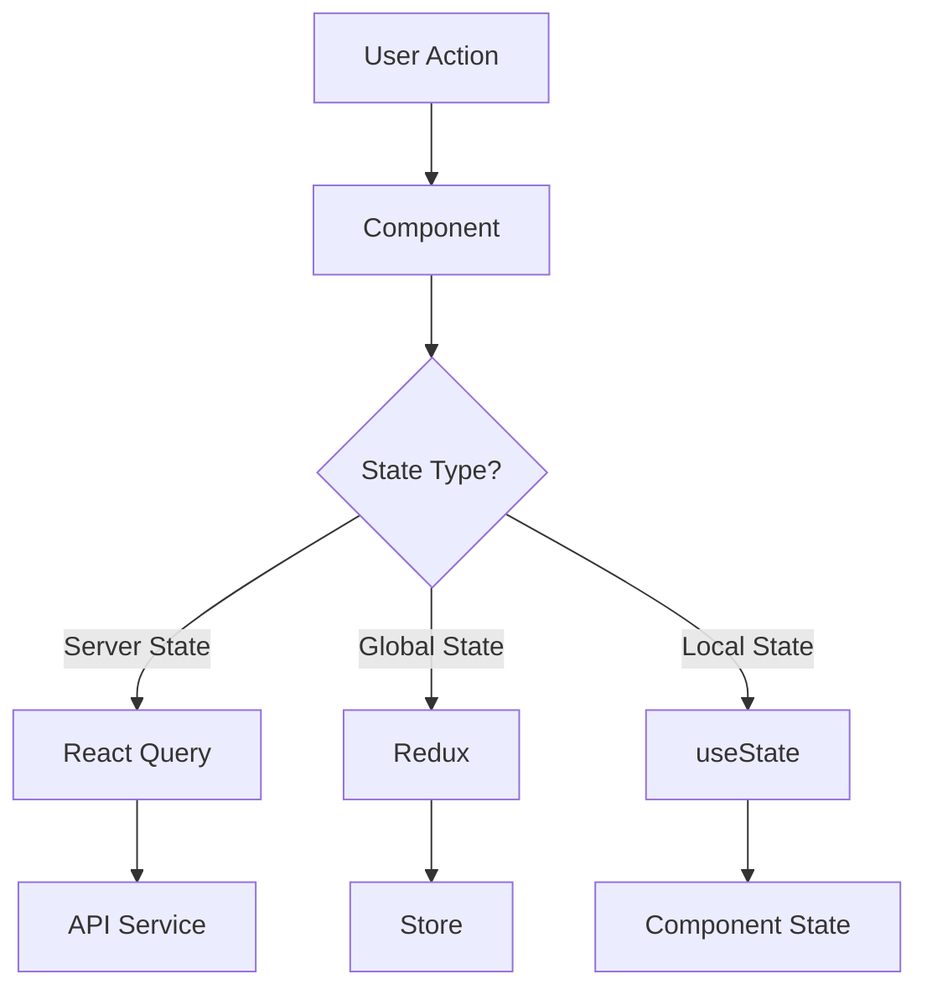

# RFID Asset Tracking System - Web Frontend

## Introduction

The RFID Asset Tracking System web frontend is a comprehensive React-based application providing real-time visibility and management of assets through an intuitive user interface. This application is designed for asset managers, operations staff, and inventory controllers who require accurate, real-time asset location data and historical tracking information.

### Key Features
- Real-time asset tracking visualization
- Interactive location mapping
- Comprehensive asset management
- Historical data analysis
- Customizable dashboards
- Role-based access control

## Prerequisites

- Node.js (>= 16.0.0)
- npm or yarn
- Recommended IDE: VS Code with the following extensions:
  - ESLint
  - Prettier
  - TypeScript
  - React Developer Tools

## Quick Start

1. Clone the repository
```bash
git clone <repository-url>
cd src/web
```

2. Install dependencies
```bash
npm install
```

3. Start development server
```bash
npm run dev
```

The application will be available at `http://localhost:3000`

## Installation

### Development Environment
```bash
# Install dependencies
npm install

# Start development server
npm run dev

# Run type checking
npm run typecheck

# Run linting
npm run lint
```

### Production Environment
```bash
# Create optimized production build
npm run build

# Preview production build
npm run preview
```

## Development

### Available Scripts

| Command | Description |
|---------|-------------|
| `npm run dev` | Start development server with hot reload |
| `npm run build` | Create optimized production build |
| `npm run test` | Run test suite with coverage report |
| `npm run lint` | Run ESLint and Prettier checks |
| `npm run typecheck` | Run TypeScript type checking |
| `npm run storybook` | Start Storybook development environment |

### Project Structure

```
src/
├── assets/          # Static assets and resources
├── components/      # Reusable React components
├── constants/       # Application constants
├── hooks/          # Custom React hooks
├── layouts/        # Page layouts and templates
├── pages/          # Page components
├── services/       # API clients and integrations
├── store/          # Redux store configuration
├── styles/         # Global styles and theming
├── types/          # TypeScript definitions
└── utils/          # Utility functions
```

## Architecture

### Technology Stack
- React 18.0+
- TypeScript 4.9+
- Redux Toolkit (state management)
- React Query (data fetching)
- Material-UI v5 (UI components)
- React-Leaflet (location visualization)
- Vite (build tool)

### State Management
- Redux Toolkit for global state
- React Query for server state
- React Context for theme/auth state
- Local component state where appropriate

### Data Flow


## Browser Support

| Browser | Minimum Version |
|---------|----------------|
| Chrome | 90+ |
| Firefox | 88+ |
| Safari | 14+ |
| Edge | 90+ |
| iOS Safari | 14+ |
| Chrome Android | 90+ |

### Polyfill Strategy
- Core-js for JavaScript features
- Automatic polyfill injection based on browserslist
- CSS vendor prefixing via PostCSS

## Performance

### Optimization Strategies
- Code splitting via React.lazy()
- Image optimization with modern formats
- Tree shaking of unused code
- Caching strategies for API responses
- Memoization of expensive computations

### Performance Metrics
- First Contentful Paint: < 1.5s
- Time to Interactive: < 3.0s
- Lighthouse Performance Score: > 90

## Security

### Implementation Guidelines
- HTTPS-only communication
- JWT token-based authentication
- XSS prevention via React's built-in escaping
- CSRF protection
- Content Security Policy implementation
- Secure cookie handling

## Troubleshooting

### Common Issues

1. Development server not starting
```bash
# Clear node_modules and reinstall
rm -rf node_modules
npm install
```

2. Type checking errors
```bash
# Verify TypeScript configuration
npm run typecheck
```

3. Build failures
```bash
# Clean build directory
rm -rf dist
npm run build
```

## Contributing

1. Fork the repository
2. Create a feature branch
3. Commit changes
4. Push to the branch
5. Create a Pull Request

### Code Review Process
- All code must pass automated checks
- Requires one approved review
- Must maintain test coverage
- Follow established coding standards

## Changelog

### [1.0.0] - 2023-10-01
- Initial release
- Core feature implementation
- Basic asset tracking functionality

### [1.1.0] - 2023-10-15
- Enhanced visualization components
- Performance optimizations
- Browser compatibility improvements

---

For more information, please contact the development team or refer to the technical documentation.